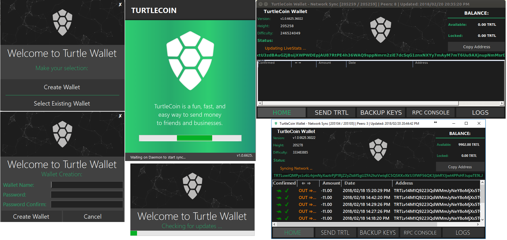

# TurtleCoin Wallet .NET

TurtleCoin Wallet written in C# for Windows and Linux through Mono.

# Download and Running

Check here for the latest release: 
https://github.com/turtlecoin/desktop-xamarin/releases

After downloading, extract and run `TurtleWallet.exe`.

# Like the project and want to send some TRTL? Why thank you!
Please instead, donate the amount to our "Rain Bot" in our Discord!

# In progress

The wallet is stable enough to run the release fine, however development is in progress. You may download the release archive or compile yourself.

# future

This repo will later be switched from WinForms and C# to Xamarin to run cross-platform on more devices.
